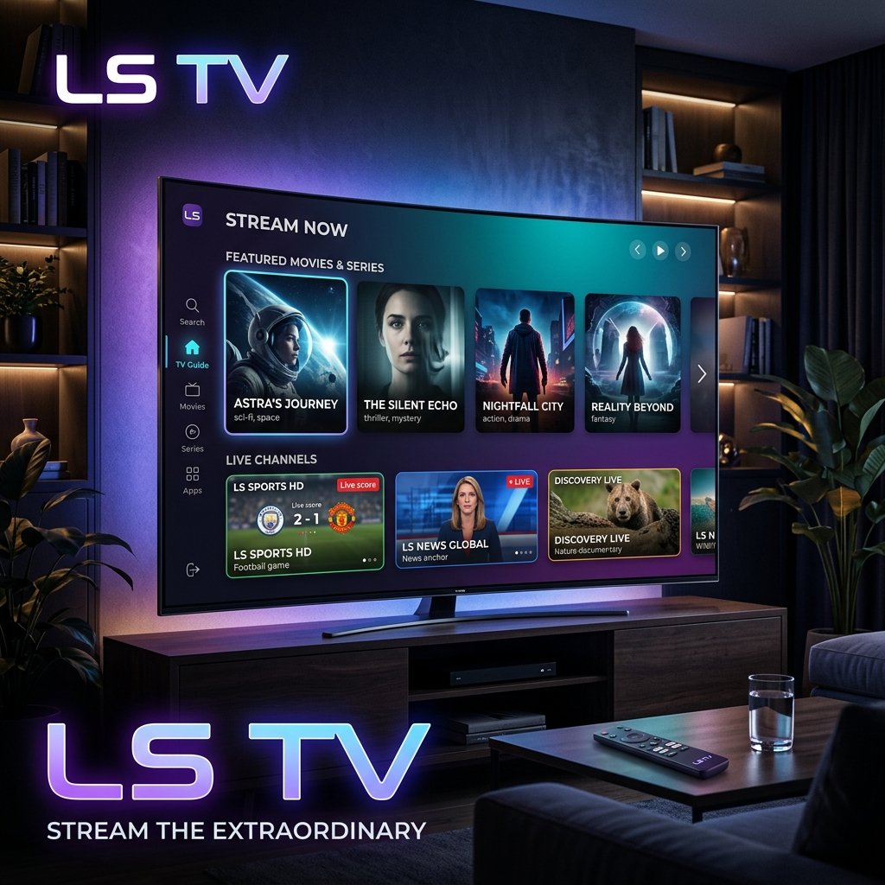
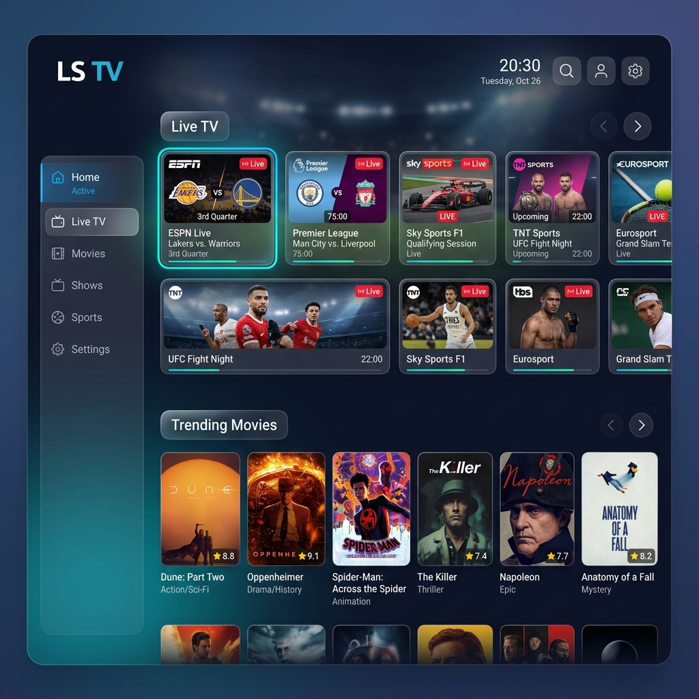

# 📺 LS TV - Premium IPTV Streaming Experience

**LS TV is a high-performance, cross-platform streaming experience designed for Android Mobile, Android TV, and the Web. Access thousands of public streams with a sleek, cinematic interface wherever you are.**

---

[**Download APK**](https://github.com/neelniloy/lstv_backend/releases/download/latest/app-release.apk) • [**Open Web App**](https://lstv-web.vercel.app/) • [**Join Community**](https://t.me/lstv_app)

## ✨ Key Features

- 📱 **Multi-Platform**: Seamless experience across **Android Mobile**, **Android TV**, and any **Modern Web Browser**.
- 🚀 **Lightning Fast**: Optimized for all devices with smooth navigation and instant playback.
- 📺 **Public Stream Index**: Access a curated list of publicly available IPTV channels.
- 🎮 **Hardware Acceleration**: Full support for hardware decoding on Android for a stutter-free experience.
- 🖼️ **Picture-in-Picture (PiP)**: Keep watching on mobile/TV while you browse other apps.
- 🔍 **Smart Search**: Find your favorite channels and events in seconds.
- ⚡ **Web Access**: Watch instantly without installation at [lstv-web.vercel.app](https://lstv-web.vercel.app/).
- 🛡️ **Privacy Focused**: No tracking, no data collection.
- 🌑 **Cinematic UI**: Modern glassmorphism design with vibrant gradients and smooth animations.

## 📸 Screenshots

  

## 🛠️ How to Hook Up

### 1. Web (Instant Access)
The easiest way to experience LS TV is directly in your browser. No installation required.
👉 **[Open LS TV Web](https://lstv-web.vercel.app/)**

### 2. Android Mobile & TV
Download the latest APK for your Android devices:

  

### 3. Install on Android TV
If you are installing on a TV, you can:
- **Direct Link**: Open the download link in your TV's browser.
- **Wireless Transfer**: Open LS TV on your mobile phone, go to **Settings > Install on Android TV**, and scan the QR code with your TV's camera or enter the URL shown.

### 4. Usage
Once installed, simply browse the categories (**Live TV**, **Movies**, **Sports Events**) and tap any channel to start streaming. Add channels to **Favorites** for quick access.

## 🏗️ Built With

- **Language**: Kotlin
- **Framework**: Jetpack (ViewModel, LiveData, Room)
- **Player**: ExoPlayer with custom optimization
- **Networking**: Retrofit & OkHttp
- **DI**: Hilt (Dagger)

## ⚖️ Disclaimer

LS TV is purely a media player and does not own, host, or distribute any media content. All content accessible through the service is freely available and publicly accessible on the internet. We do not hold any legal permission, broadcast rights, or licenses for any of the content provided.

---

  Made with ❤️ by <a href="https://github.com/neelniloy">Niloy Sarker</a>

